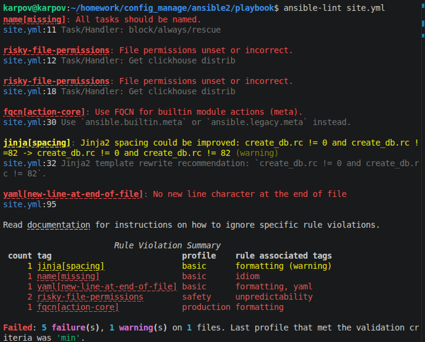
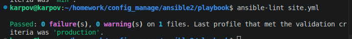
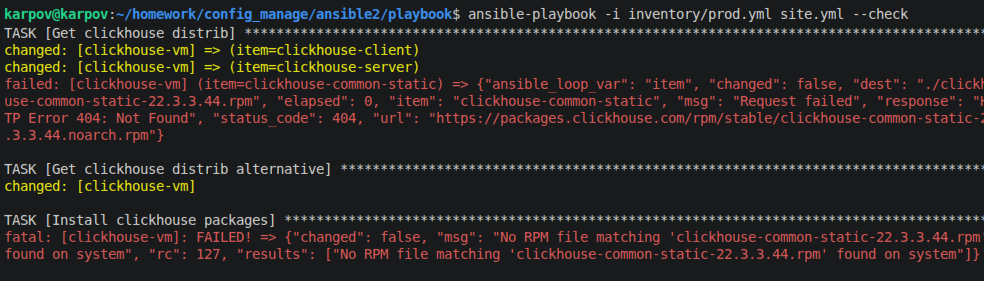
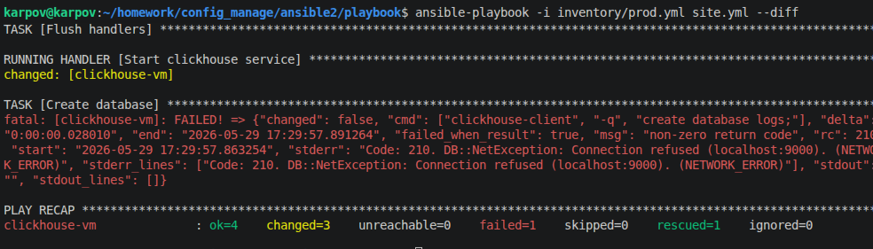
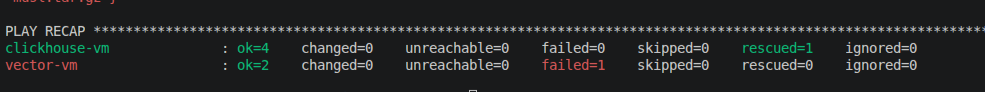

## Домашнее задание к занятию 2 «Работа с Playbook». Карпов Антон Юрьевич

### Основная часть

1. Подготовьте свой inventory-файл prod.yml.
2. Допишите playbook: нужно сделать ещё один play, который устанавливает и настраивает vector. Конфигурация vector должна деплоиться через template файл jinja2. От вас не требуется использовать все возможности шаблонизатора, просто вставьте стандартный конфиг в template файл. Информация по шаблонам по ссылке. не забудьте сделать handler на перезапуск vector в случае изменения конфигурации!
3. При создании tasks рекомендую использовать модули: get_url, template, unarchive, file.
4. Tasks должны: скачать дистрибутив нужной версии, выполнить распаковку в выбранную директорию, установить vector.
5. Запустите ansible-lint site.yml и исправьте ошибки, если они есть.
6. Попробуйте запустить playbook на этом окружении с флагом --check.
7. Запустите playbook на prod.yml окружении с флагом --diff. Убедитесь, что изменения на системе произведены.
8. Повторно запустите playbook с флагом --diff и убедитесь, что playbook идемпотентен.
9. Подготовьте README.md-файл по своему playbook. В нём должно быть описано: что делает playbook, какие у него есть параметры и теги. Пример качественной документации ansible playbook по ссылке. Так же приложите скриншоты выполнения заданий №5-8
10. Готовый playbook выложите в свой репозиторий, поставьте тег 08-ansible-02-playbook на фиксирующий коммит, в ответ предоставьте ссылку на него.

## Решение

Проверка ansible-lint:

Было исправлено по требованиям линтера:

- name[missing]: Добавлено имя - name: Download Clickhouse для всего блока block/rescue.
- risky-file-permissions: Для обоих модулей ansible.builtin.get_url в секции Clickhouse явно прописаны права mode: "0644".
- fqcn[action-core]: Вызов meta заменен на полное имя ansible.builtin.meta.
- jinja[spacing]: В строке failed_when добавлен пробел перед числом 82 (!= 82).
- yaml[new-line-at-end-of-file]: Добавлен корректный перенос строки на последней 95-й строчке.

Запуск после исправления:

Запуск плейбука с --check

Ошибка возникает из-за режима проверки - файлы не скачиваются.

Запуск с --diff - изменения есть:

С третьего раза идемпотентность появилась, судя по всему потому, что ansible не дождался запуска clickhouse:

